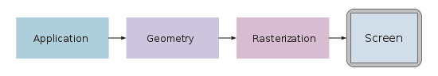
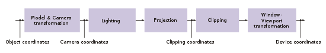

# Render Engine Design
CPU based render engine - No GPU API hassule is being used.

Design is still in progress.
# PipeLine

## Application 
`input` : scene description file [TODO](adel) : model path for now
`output` : vertex attributes in model space
- Reads the models 
- User input handling (keyboard and mouse)
- Update states (Camera , models,...)
- [TODO](adel) : spatial partioning data structures (bounding boxes , ...)
- sends the models vertex attributes to the `Geometry` stage

## Geometry
`input` : Vertex attributes in model space
`output` : vertex attributes in NDC (Normalized device coordinates) space

- apply model-world-camera transformation
- per-vertex lighting calculations [TODO](adel): per-fragment lighting
- prespective projection
- clip verticies out of the clip space [TODO](adel) : support clip planes
- [TODO](adel) face culling: discard outword facing triangles
- window transformation
- send the vertex attributes in NDC space to `Rastertization` stage

## Rasterization

`input` : vertex attributes in NDC (Normalized device coordinates) space
`output` : pixels in a framebuffer with width and height corresponding to the window dimentions

- perform primitive assembly
- find the set of fragments that each primitive fills
- interpolate the vertex attributes across the promitive fragments
- perform depth testing using z-buffer
- update the backbuffer and notify the window manager to swap buffer and present the new frame

### Note To myself
try to use as most of cpu caps as possible , SIMD , multi-threading.
