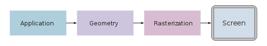
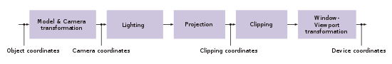

# Render Engine Design
CPU based render engine - No GPU API hassule is being used.

> NOTE : This Readme might not be updated to include changes in the code base yet.
 
Design is still in progress.

# PipeLine

## Application 
`input` : scene description file [TODO](adel) : model path for now  
`output` : vertex attributes in model space
- Reads the models 
- User input handling (keyboard and mouse)
- Update states (Camera , models,...)
- [TODO](adel) : spatial partioning data structures (bounding boxes , ...)
- sends the models vertex attributes to the `Geometry` stage

## Geometry
`input` : Vertex attributes in model space  
`output` : vertex attributes in pixel space

- apply model-world-camera transformation
- per-vertex lighting calculations [TODO](adel): per-fragment lighting
- prespective projection
- clip verticies out of the clip space [TODO](adel) : support clip planes
- [TODO](adel) face culling: discard outword facing triangles
- window transformation
- send the vertex attributes in pixel space to `Rastertization` stage

## Rasterization

`input` : vertex attributes in pixel space  
`output` : pixels in a framebuffer with width and height corresponding to the window dimentions

- perform primitive assembly
- find the set of fragments that each primitive fills
- interpolate the vertex attributes across the promitive fragments
- perform depth testing using z-buffer
- update the backbuffer and notify the window manager to swap buffer and present the new frame

### Note To myself
try to use as most of cpu caps as possible , SIMD , multi-threading.

## TODO
1. <del>Refactor the engine, handle  only d3d11 and remove any software-backend related stuff</del>
2. <del>Refactor Application stuff, and make it more flexable to use </del>
3. <del>make the engine API more verbose with options to render the scene and models, (i.e enable shadows, wireframe, transparentcy,...), passes should not be implemented into the main by the user.<del>
4. add imgui support
5. <del>render light (toggle rendering the light as sprites from the engine)<del>
6. <del> render bounding-boxes for scence models </del>
7. add logging
8. make a branch that uses only software backend for showcasing
9. make new engine after all this to be the main branch state
10. edit readme
11. fix rendeing artifacts (lighting direction, shadows, black flickering...)
